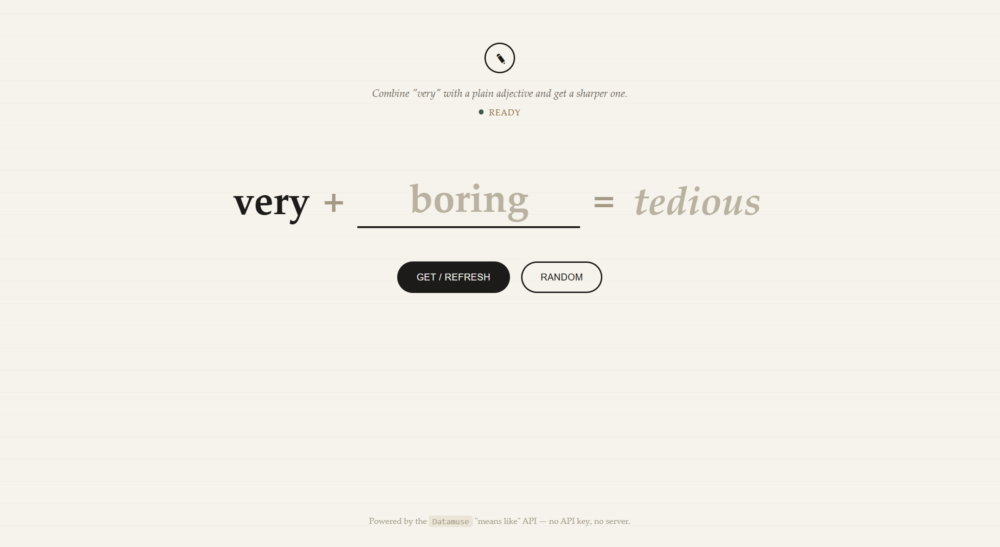
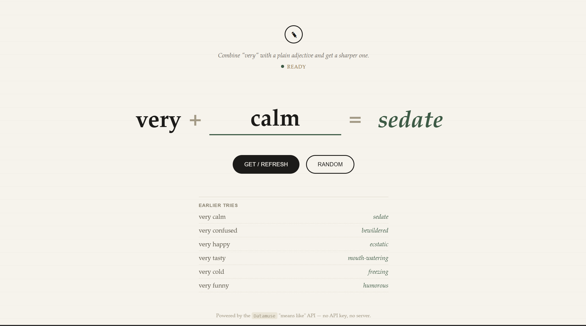
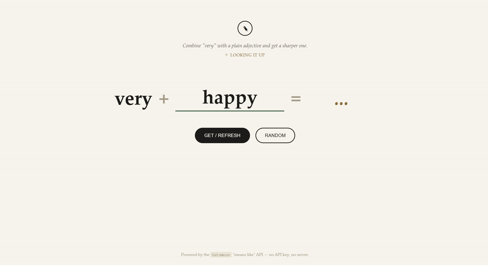

# Vocab Enhancer App

## About The Project




## Built With
HTML|CSS|JavaScript|Datamuse API

## Getting Started

This section provides instructions on setting up your project locally. Follow these steps to get a local copy up and running:

### Installation Steps

1. **Clone the Repository**
```bash
git clone https://github.com/shubhangi177/VocabEnhancer.git
```
2. **Open the Project**

Open the project folder in your preferred code editor.

3. **Run the Application**

Open the index.html file in your web browser.

No API key or server setup is required. The application directly uses the Datamuse API to retrieve word suggestions.

### How It Works

1. Enter a common adjective in the input field.
2. Click Get / Refresh to find a stronger alternative.
3. Use the Random button to try a randomly selected word.
4. The application displays the suggested word and stores the previous six attempts under Earlier tries.
5. The application first checks its predefined word list and, if a matching word is not available, sends a request to the Datamuse API to find a suitable alternative.
